# Otter Calendar

A fast calendar for several Google accounts at once, with an assistant that can read and change
all of them. Web, desktop and mobile, on a server you own.

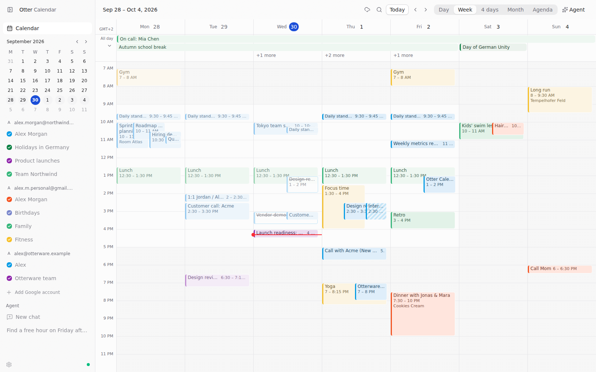

**Walkthrough** (47 s; [MP4](docs/assets/walkthrough.mp4)):


## What it does

- **Every account in one view.** Connect several Google accounts; each account's calendars are
  listed with their colors and can be shown or hidden. Day, week, several days, month and an
  agenda that scrolls in both directions.
- **Direct manipulation.** Drag to create, move (across days, and between the all-day row and
  the hours) and resize, snapped to 15 minutes, with keyboard equivalents. Changes show at once,
  roll back if Google refuses them, and undo with **Mod+Z**.
- **Real calendar semantics.** Overlapping events cascade like Google Calendar, multi-day and
  all-day events have their own row, time zones and DST are handled exactly, and repeating events
  can be changed for this occurrence, this and following, or all of them.
- **Keyboard first.** Google Calendar's shortcuts (T, D/W/X/M/A, J/K, C, /, G), a command palette
  (**Mod+K**), and search across every account.
- **An assistant that uses your calendars.** It runs on your own Claude or Codex subscription and
  gets calendar tools: list and search events across accounts, create, move and delete events,
  answer invitations, and find free time across every calendar.
- **Your data stays on your server.** The environment server syncs Google Calendar into SQLite
  and streams only what each view shows to your devices. Try it with no account at all: the demo
  data source fakes realistic Google accounts.

| Month                                      | Agenda                                       |
| ------------------------------------------ | -------------------------------------------- |
| 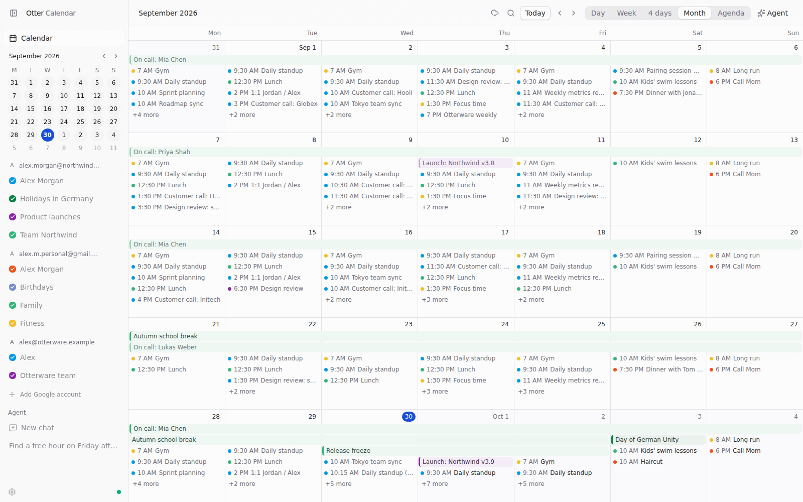 | 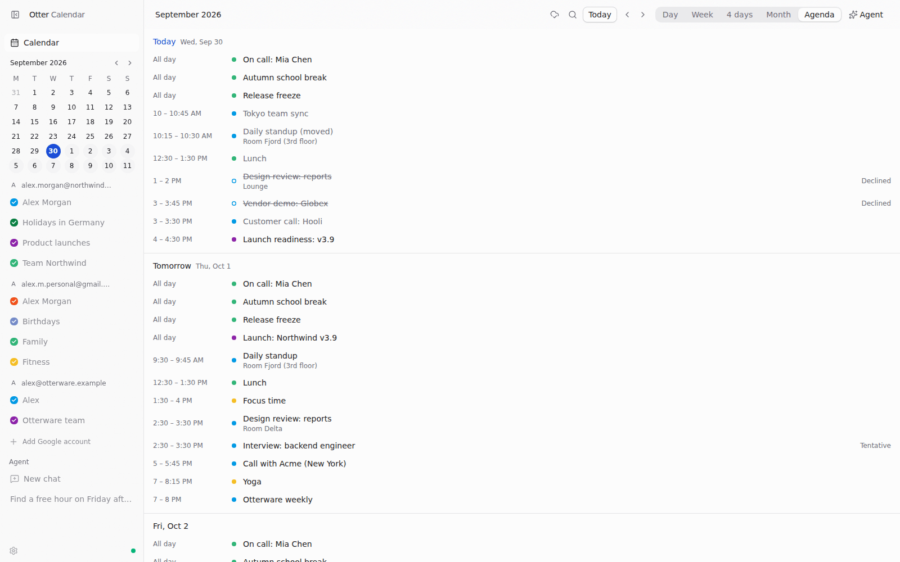 |

| Day                                    | Dragging an event                               |
| -------------------------------------- | ----------------------------------------------- |
| 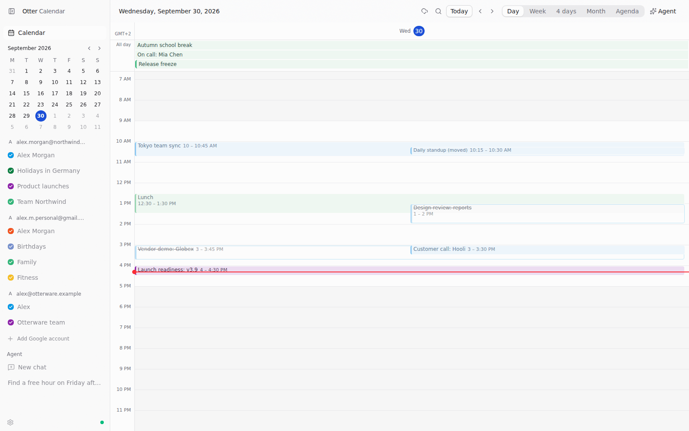 | 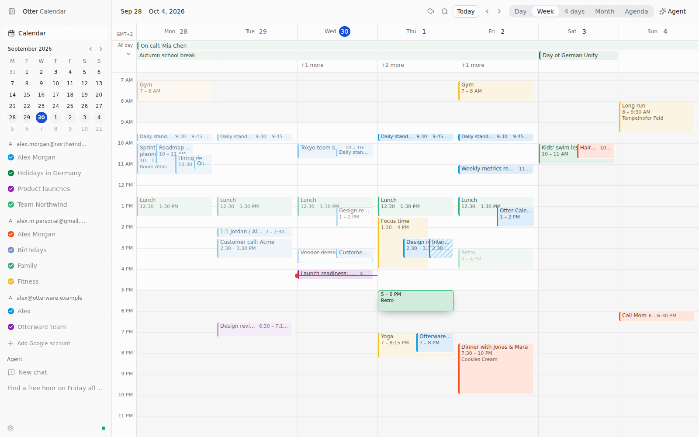 |

| Event details and RSVP                          | Editor                                        |
| ----------------------------------------------- | --------------------------------------------- |
| 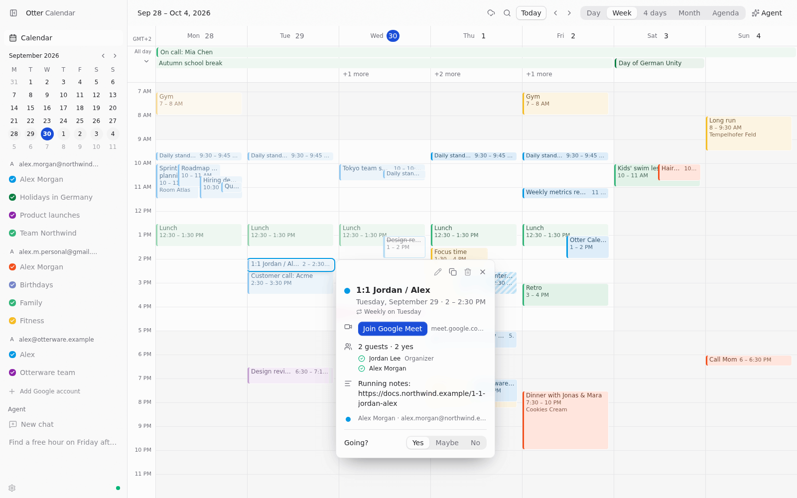 | 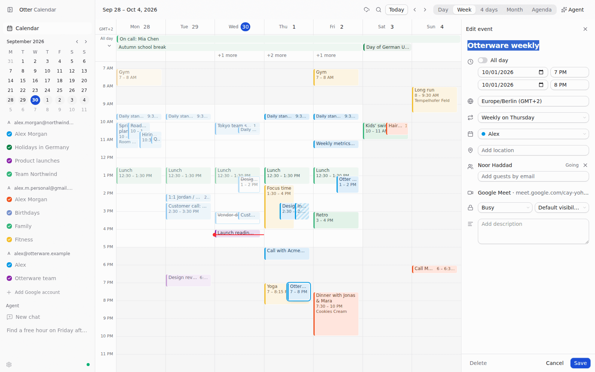 |

| The assistant booking a free hour across accounts             | Search across accounts                  |
| ------------------------------------------------------------- | --------------------------------------- |
| 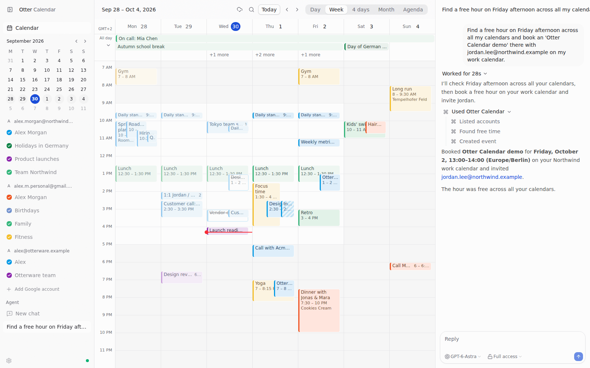 | 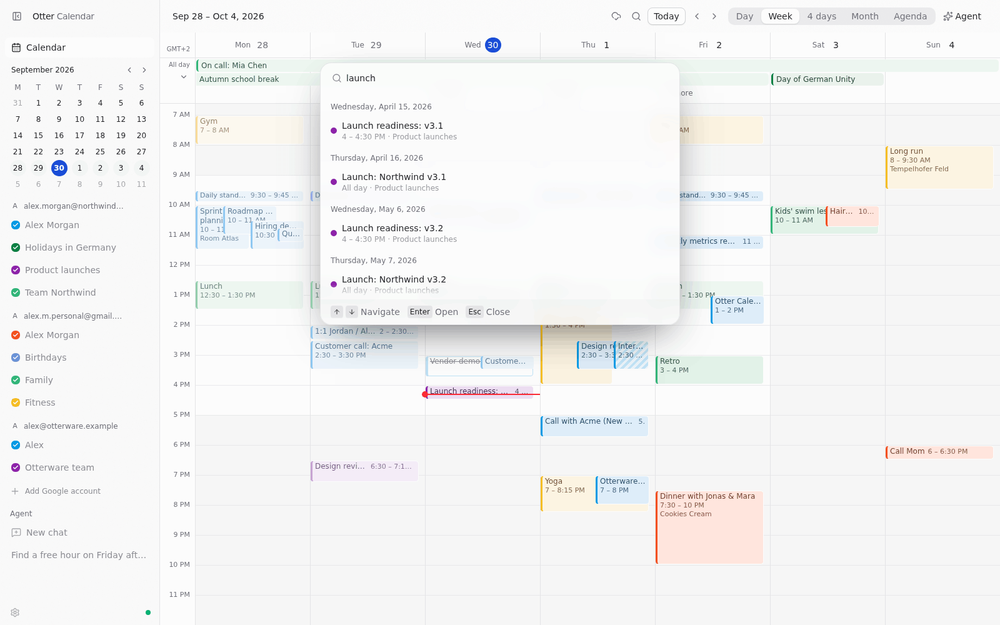 |

| Dark                                     | Calendar settings                                    |
| ---------------------------------------- | ---------------------------------------------------- |
| 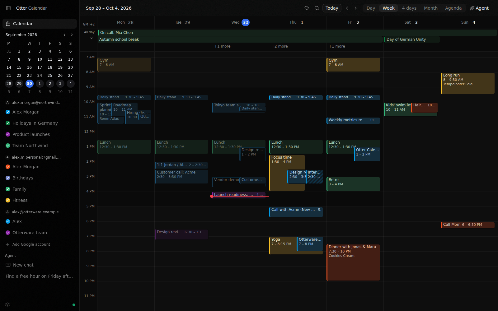 | 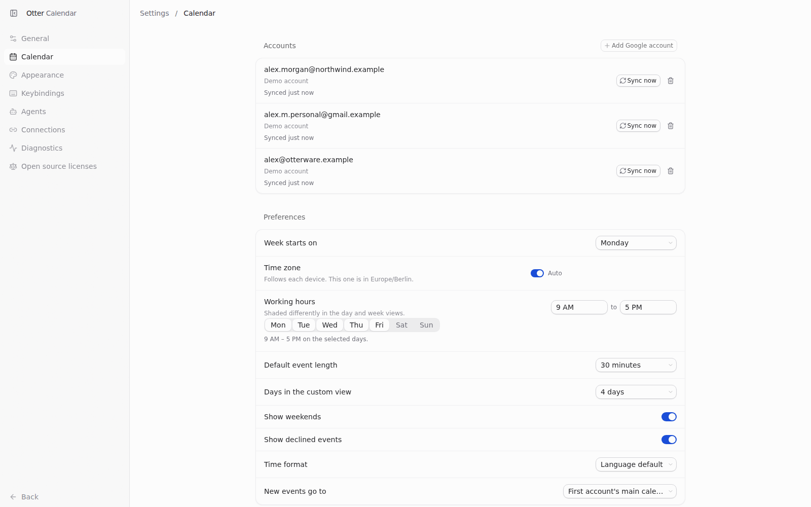 |

More: [month, dark](docs/assets/month-dark.png) · [editor, dark](docs/assets/editor-dark.png) ·
[four days](docs/assets/four-days-light.png) · [sidebar](docs/assets/sidebar.png).

## Fast, measured

On a deliberately absurd dataset (10 accounts, 40 calendars, 129,000 occurrences), with 155
events in a week: pages change in about 100 ms from key press to paint, drags and the agenda
scroll at 60 fps without long tasks, and a week of data costs 5 KB on the wire. Methodology,
the stress case (830 events a week) and what the measurements changed are in
[docs/performance.md](docs/performance.md); the engine's design and the libraries we evaluated
are in [docs/internals/calendar-engine.md](docs/internals/calendar-engine.md).

## Develop

You need Node 24 and [Vite+](https://viteplus.dev/guide/) (`curl -fsSL https://vite.plus | bash`).

```sh
vp i                                        # install
T3CODE_CALENDAR_DEMO=standard vp run dev    # server + web with demo accounts; open the printed URL
vp run dev:desktop                          # the Electron app
```

`T3CODE_CALENDAR_DEMO` seeds demo accounts when an environment has none: `standard`, or `massive`
for the performance dataset (`massive:7` picks the seed). In the app, **Explore with demo data**
does the same.

To connect real Google accounts, the environment needs a Google OAuth client of type **Desktop
app** with the Google Calendar API enabled: set `T3CODE_GOOGLE_CLIENT_ID` and
`T3CODE_GOOGLE_CLIENT_SECRET` (in the root `.env` for builds, or in the server's environment), or
enter them under **Settings → Calendar → Google sign-in**. See [SCAFFOLD.md](SCAFFOLD.md#external-setup)
for the rest of the external setup (accounts, relay, releases, mobile).

[AGENTS.md](AGENTS.md) has the conventions (read it before changing code, human or agent), and
[docs/](docs) has the user guide, architecture notes and runbooks. Performance scripts live in
[scripts/perf](scripts/perf).

## Built on Otter Scaffold

Otter Calendar is built from [Otter Scaffold](https://github.com/otterware-app/otter-scaffold),
which is [Otter Code](https://github.com/acme-acme-acme/otter-code) (our fork of
[T3 Code](https://github.com/pingdotgg/t3code)) with the coding product taken out: the environment
server (Effect, WebSocket RPC, SQLite, auth and pairing), T3 Connect remote access, the web,
Electron and Expo clients, the agent layer and the release pipelines. Scaffold updates merge from
the `scaffold` remote; see [SCAFFOLD.md](SCAFFOLD.md).

## License

MIT, like T3 Code. See [LICENSE](LICENSE).
